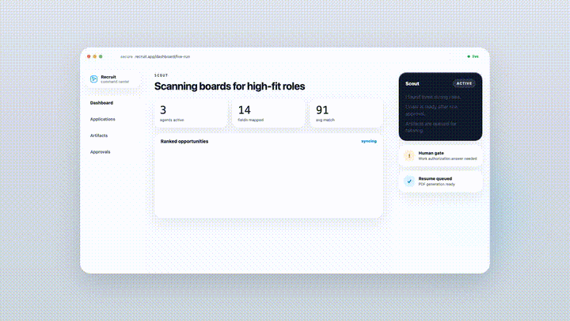
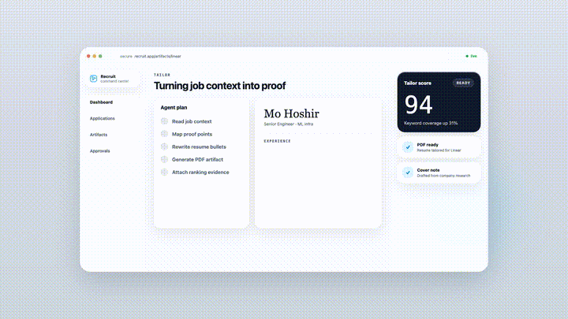
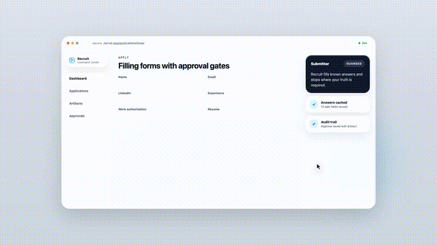
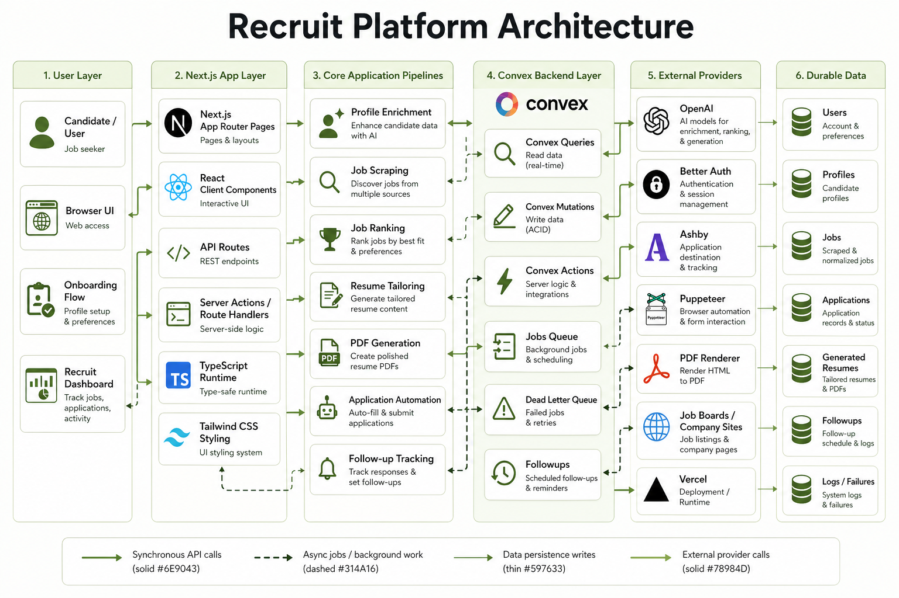
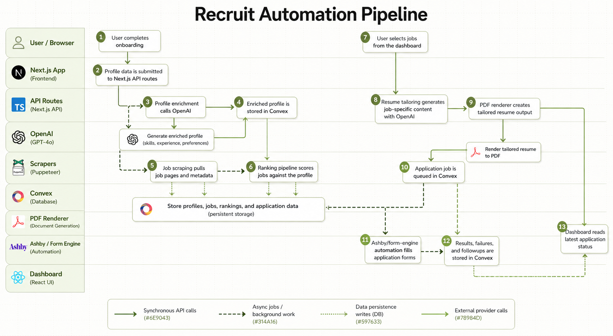
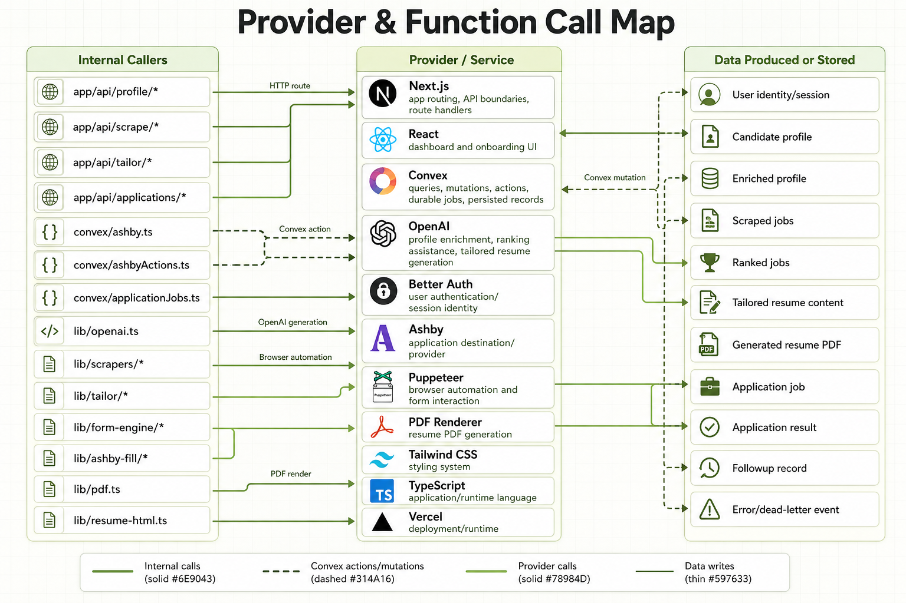

# Recruit

### AI agents for the job hunt.

Recruit is an autonomous job-application system for turning one candidate
profile into a supervised application pipeline: enrich the profile, discover
roles, rank fit, tailor the resume, fill application forms where safe, and stop
when the answer requires human truth.


[](https://nextjs.org)
[](https://react.dev)
[](https://www.typescriptlang.org)
[](https://tailwindcss.com)
[](https://www.convex.dev)
[](https://openai.com)
[](https://www.anthropic.com)
[](https://www.better-auth.com)
[](https://threejs.org)
[](#provider-status)

## Demo

These clips are regenerated from the Remotion demo assets. They show the
intended loop without performing a real ATS submit.

| Discover | Tailor | Apply |
| :---: | :---: | :---: |
|  |  |  |
| Ingest jobs and rank the best fits. | Research the role and produce a tailored PDF. | Map ATS questions and stop before unsafe guesses. |

## Architecture

The diagrams below are static architecture references for the current system.
They replace the earlier Mermaid sketches so the README matches the project
architecture artifacts directly.

### Platform Architecture



### Automation Pipeline



### Provider And Function Call Map



## Why It Exists

Job applications are repetitive, lossy, and easy to abandon. A useful agent
cannot guess its way through employment history, work authorization, legal
questions, compensation expectations, or demographic fields.

Recruit is built around a supervised loop:

- One profile becomes reusable job-search memory.
- Intake adapters enrich the profile from resume, GitHub, LinkedIn, web links,
  and chat.
- Jobs are ingested and ranked before time is spent tailoring.
- Resume tailoring is checked against the candidate profile to avoid invented
  employers, skills, projects, or degrees.
- ATS answers are mapped from safe profile facts, approved cached answers, and
  explicit human review.
- Sensitive or unknown answers go to the review queue instead of being guessed.

## What It Does

| Surface | Purpose |
| --- | --- |
| `/` | Product overview and animated landing surface. |
| `/onboarding` | Five-step profile intake: account, resume, connected sources, preferences, activation. |
| `/profile?view=data\|graph` | Candidate profile dashboard with data and graph views. |
| `/dashboard` | Command center for ingestion, ranking, tailoring, artifacts, and follow-ups. |
| `/3d` | 3D room view of the parallel agent squad. |
| `/dlq` | Human review queue for questions the agent will not answer on its own. |
| `/pricing` | Test or mock checkout surface for plan selection. |
| `/settings` | Browser-side profile and preference management. |

## How The Agents Fill Applications

The agents are parallel workers, not narrow specialists. Each one can run the
full application loop for one target: source the role, inspect fit, tailor
artifacts, map form answers, stage submission evidence, and report back.

The fill policy is intentionally conservative:

- Safe profile facts can be filled from the candidate profile.
- Approved cached answers can be reused when the prompt and scope match.
- LLM drafts are allowed only for appropriate custom narrative fields.
- Work authorization, sponsorship, compensation, legal, demographic, and unknown
  required fields go to DLQ or human review.
- Ashby is the live form-fill path today. Greenhouse, Lever, Workday, and job
  board integrations remain ingestion or preview paths unless verified for fill.
- Final submit is gated. Dry runs and staged evidence are the default posture.

### Recruit2 Apply Engine Integration

Recruit Main now exposes an Apply Service boundary that lets the product
workflow use the Recruit2 computer-use pipeline without copying the whole
Recruit2 app into this repo.

- Recruit Main owns discovery, shortlisting, profile memory, resume tailoring,
  grouped review questions, and the dashboard Apply Hub.
- Recruit2 owns browser perception, Browserbase cloud sessions, AI
  computer-use actions, file upload dexterity, deferred field repair, and final
  application state.
- `POST /api/applications/batch/start` accepts shortlisted jobs, the candidate
  profile, tailored resume metadata, model/mode settings, and consent. If
  `APPLY_ENGINE_API_URL` or legacy `RECRUIT2_APPLY_API_URL` is configured, it
  forwards the batch to the application engine's `/api/apply-lab/v4/runs`
  endpoint. Recruit Main does not use the old public Apply Lab URL or a
  hard-coded `localhost:9000` service; deployments should point this setting at
  the real backend engine only when one is available.
- The dashboard Apply Hub supports top-N jobs plus pasted external URLs, Nano /
  Mini / Sonnet computer-use selection, up to 20 active applications, grouped
  deferred questions, review items, and development-mode approval that marks a
  job submitted without clicking the real external submit button.
- U.S. citizenship and work authorization are mapped into the Recruit2 profile
  as profile-backed facts, including `authorizedUS: true`,
  `needsSponsorshipNow: false`, and `needsSponsorshipFuture: false`, so those
  fields should not become user questions.

Apply Service route handlers:

| Route | Purpose |
| --- | --- |
| `POST /api/applications/batch/start` | Start a multi-job application batch. |
| `GET /api/applications/runs/:runId` | Read the current run, job states, review items, and question groups. |
| `GET /api/applications/runs/:runId/events` | Read the run event timeline. |
| `GET /api/applications/runs/:runId/questions` | Read grouped deferred questions. |
| `POST /api/applications/runs/:runId/questions/resolve-batch` | Apply one set of answers across matching fields/jobs. |
| `POST /api/applications/runs/:runId/jobs/:jobId/approve` | Approve a job; local dev marks it `submitted_dev`. |
| `POST /api/applications/runs/:runId/jobs/:jobId/cancel` | Cancel one job in the batch. |

## Provider Status

| Provider | Current role | Status |
| --- | --- | --- |
| Ashby | Job ingestion, direct application URLs, form fill/stage, evidence capture | Live primary path |
| GitHub | OAuth, profile enrichment, repository/activity intake | Live intake path |
| LinkedIn | Browserbase-assisted profile intake | Preview path |
| Greenhouse | Public job ingestion | Preview |
| Lever | Public job ingestion and benchmark work | Preview |
| Workday | Report-feed ingestion with configured credentials | Preview |
| Stripe | Test-mode or mock checkout | Demo billing surface |

## Tech Stack

| Layer | Technology | Purpose |
| --- | --- | --- |
| App | Next.js 16, React 19, TypeScript | App Router UI, route handlers, auth-gated app shell. |
| Styling | Tailwind CSS v4, local design-system components, lucide-react | Dashboard UI, controls, status badges, icons. |
| Motion and 3D | motion, Three.js, React Three Fiber, Drei, Zustand | Onboarding animation and 3D agent room. |
| Backend | Convex, Convex HTTP client | Pipeline state, actions, scheduling, artifacts, DLQ, follow-ups. |
| Auth | Better Auth, `@convex-dev/better-auth` | Email/GitHub auth and Convex session propagation. |
| AI | OpenAI, Anthropic AI SDK, MiniSearch | Profile extraction, ranking support, research, tailoring, answer drafts. |
| Intake | Octokit, Browserbase, Playwright Core, resume parsing | GitHub, LinkedIn, resume, web, and chat enrichment. |
| ATS automation | Puppeteer-compatible page layer, Ashby adapter, form engine | Form discovery, answer mapping, safety checks, staged evidence. |
| Documents | PDF rendering helpers, `unpdf`, `pdfjs-dist` | Resume parsing and tailored PDF artifacts. |
| Deployment | Vercel-compatible Next.js runtime | App hosting and route execution. |

## Local Development

```bash
npm install
npm run dev
# open http://localhost:3000
```

Useful optional environment variables:

| Capability | Variables |
| --- | --- |
| Convex app data | `NEXT_PUBLIC_CONVEX_URL`, `NEXT_PUBLIC_CONVEX_SITE_URL`, `CONVEX_DEPLOYMENT` |
| Dashboard sample jobs | Checked-in `data/om-demo` is the default in local and deployed builds. Set `DASHBOARD_DATA_SOURCE=convex` and `DASHBOARD_LIVE_CONVEX_ENABLED=true` only when intentionally testing live Convex dashboard reads. |
| Better Auth | `BETTER_AUTH_SECRET`, `NEXT_PUBLIC_SITE_URL`, `ADDITIONAL_TRUSTED_ORIGINS` |
| GitHub intake | `GITHUB_CLIENT_ID`, `GITHUB_CLIENT_SECRET`, `NEXT_PUBLIC_GITHUB_OWNER` |
| AI paths | `OPENAI_API_KEY`, `ANTHROPIC_API_KEY`, `GEMINI_API_KEY`, `TAILOR_PROVIDER`, `TAILOR_MODEL`, `GEMMA_TAILOR_MODEL`, `RESEARCH_PROVIDER`, `RESEARCH_MODEL`, `GEMMA_RESEARCH_MODEL`, `OPENAI_RANKING_MODEL`, `OPENAI_ASHBY_FILL_MODEL` |
| LinkedIn/browser intake | `BROWSERBASE_API_KEY`, `BROWSERBASE_PROJECT_ID`, `COOKIE_ENCRYPTION_KEY` |
| Application engine | `APPLY_ENGINE_API_URL` or legacy `RECRUIT2_APPLY_API_URL`, `MAX_APPLICATIONS_PER_RUN`, `MAX_CONCURRENT_APPLICATIONS`, `MAX_CONCURRENT_PER_DOMAIN`, `DEV_SKIP_REAL_SUBMIT` |
| Scraping fallbacks | `FIRECRAWL_API_KEY`, `PROXYCURL_API_KEY` |
| Checkout | `STRIPE_SECRET_KEY`, `STRIPE_CHECKOUT_MOCK`, `NEXT_PUBLIC_APP_URL` |
| Browser/PDF runtime | `LOCAL_CHROME_PATH`, `LOCAL_CHROME_HEADLESS`, `LOCAL_CHROME_USER_DATA_DIR`, `CHROMIUM_PACK_URL` |

Do not commit `.env*`, local auth files, API keys, browser profiles, or generated
production evidence.

Resume tailoring defaults to OpenAI. To use Gemma 4 for the tailoring step, set
`TAILOR_PROVIDER=gemini`, `GEMINI_API_KEY`, and optionally
`TAILOR_MODEL=gemma-4-26b-a4b-it` or `TAILOR_MODEL=gemma-4-31b-it`.
When OpenAI is not configured, job-research extraction can also use Gemma from
the ingested or scraped job description; OpenAI remains the deep web-research
path.

## Validation

```bash
npm run lint
npm run test:core
npm run test:api
npm run test:apply-service
npm run test:apply-service-api
npm run build
```

The combined quality gate is:

```bash
npm run ci:quality
```

Production-like smoke testing lives in
[`PRODUCTION_E2E_TEST_PROMPT.md`](PRODUCTION_E2E_TEST_PROMPT.md). That runbook
keeps ATS submit dry-run by default and requires an explicit test-only submit
gate before any real final submit.

## Roadmap

- Keep Ashby as the primary verified fill provider.
- Promote Greenhouse, Lever, Workday, and other ATS paths from preview to
  verified fill only after targeted provider evidence exists.
- Expand DLQ approval UX and answer-cache auditing.
- Add hosted demo links and fresh README media after each major demo pass.
- Continue tightening resume-quality checks around fabricated or unsupported
  claims.
