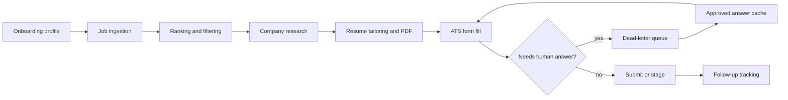

# Recruit README Plan

Reference style: `obro79/Rehabify` uses a strong one-line promise, large product visual, badge tags, problem/solution framing, a demo gallery, feature breakdowns, an architecture flow, stack table, quick start, and roadmap. Recruit should follow that rhythm while staying specific to the autonomous job-application agent.

## Six Things To Include

| # | README section | What it should communicate | Visual or proof |
|---|---|---|---|
| 1 | Hero, promise, and tags | Recruit is an AI agent squad that finds roles, researches companies, tailors resumes, fills applications, and pauses for human truth instead of guessing. | Main hero GIF or screenshot from `marketing-video/out/hero.mp4`; badge row for hackathon/status plus core tech. |
| 2 | Problem and solution | Manual applications are repetitive, low-signal, and easy to abandon; Recruit turns the process into a supervised pipeline with reusable profile memory. | Short problem table like Rehabify, then a concise solution paragraph. |
| 3 | Demo gallery | Show the product instead of only describing it: onboarding chat, dashboard pipeline, tailored resume/PDF, Ashby application filling, dead-letter queue, and completion state. | Convert `marketing-video/out/*.mp4` into README-friendly GIFs or WebM clips under `public/readme/`. |
| 4 | Core product loop | Explain the end-to-end flow: profile intake -> job ingestion -> ranking -> company research -> resume tailoring -> ATS form fill -> DLQ review -> follow-up tracking. | Mermaid or ASCII pipeline diagram, plus links to relevant app routes. |
| 5 | Safety and human-in-the-loop controls | Recruit should not fabricate sensitive answers, employers, authorization details, or submit without the configured gate. Emphasize DLQ, answer caching, evidence, and quality checks. | Screenshot/GIF of `/dlq`; callouts for anti-fabrication resume validation and submit policy. |
| 6 | Tech stack, setup, and roadmap | Make it easy for another engineer or judge to understand what is real, what is mocked, and how to run it locally. | Stack table, local dev commands, required env vars grouped by capability, test commands, and "what's next" checklist. |

## Proposed README Order

1. `# Recruit`
2. Subtitle: `AI agents for the job hunt`
3. Hero visual
4. Badge row
5. Navigation links: `Demo` | `Problem` | `How It Works` | `Safety` | `Tech Stack` | `Quick Start`
6. `## The Problem`
7. `## The Solution`
8. `## Demo`
9. `## Features`
10. `## How It Works`
11. `## Safety Model`
12. `## Tech Stack`
13. `## Quick Start`
14. `## Testing`
15. `## Project Structure`
16. `## What's Next`

## Badge Tags

Use shields similar to Rehabify:

```md
[](#)
[](https://nextjs.org)
[](https://react.dev)
[](https://www.typescriptlang.org)
[](https://www.convex.dev)
[](https://openai.com)
[](https://threejs.org)
```

Optional tags if they are part of the final demo path:

```md
[](#)
[](https://tailwindcss.com)
[](https://www.better-auth.com)
```

## GIF And Media Plan

Current source clips:

| Source clip | README asset target | README use |
|---|---|---|
| `marketing-video/out/hero.mp4` | `public/readme/hero.gif` | Hero visual under the title. |
| `marketing-video/out/discover.mp4` | `public/readme/discover.gif` | Job discovery and ranking demo. |
| `marketing-video/out/tailor.mp4` | `public/readme/tailor.gif` | Resume tailoring and PDF artifact demo. |
| `marketing-video/out/apply.mp4` | `public/readme/apply.gif` | Application filling / Ashby provider demo. |
| `marketing-video/out/complete.mp4` | `public/readme/complete.gif` | Completed run or success state. |

If GIFs are too large, prefer optimized WebM/MP4 links in the GitHub README or use smaller static screenshots in a three-column demo table.

## Section Notes

### 1. Hero, Promise, And Tags

Candidate copy:

> Recruit is an autonomous job-application agent that finds high-fit roles, tailors your resume, fills ATS forms, and stops when it needs your judgment.

Keep the headline direct. A good README H1/subtitle pair:

```md
# Recruit
### Apply to jobs without applying.
```

### 2. Problem And Solution

Problem bullets to include:

- Job seekers repeat the same profile facts across dozens of ATS forms.
- Most applications need role-specific research and resume tailoring, but doing it manually does not scale.
- Agents can make dangerous guesses unless sensitive answers are explicitly gated.
- Tracking follow-ups, cached answers, and application evidence becomes a separate job.

Solution paragraph should mention:

- One onboarding profile becomes reusable job-search memory.
- Jobs are ingested and ranked before time is spent tailoring.
- Resume tailoring is validated against the source profile to avoid invented employers or skills.
- Dead-letter queue keeps sensitive answers human-approved.

### 3. Demo Gallery

Suggested table:

```md
| Discover | Tailor | Apply |
|:---:|:---:|:---:|
|  |  |  |
```

Add one full-width hero GIF above the table if file size allows.

### 4. Core Product Loop

Suggested diagram:



Routes worth documenting:

| Route | Purpose |
|---|---|
| `/` | Landing page and product pitch. |
| `/onboarding` | Chat-style profile intake, resume parsing, public-link scraping, and pipeline launch. |
| `/dashboard` | Command center for ingestion, ranking, tailoring, artifacts, follow-ups, and metrics. |
| `/dashboard/room` | 3D room view of the parallel agent squad. |
| `/dlq` | Human review queue for questions the agent will not guess. |
| `/pricing` | Mock pricing surface for the demo. |
| `/settings` | Profile and preference management. |

### 5. Safety And Human-In-The-Loop Controls

This should be its own README section, not just a footnote. Include:

- DLQ for unanswerable or sensitive fields.
- Approved-answer cache for reuse after explicit approval.
- Submit policy that can stage instead of final-submit.
- Evidence bundle from form automation.
- Resume quality checks that reject fabricated employers and unsupported claims.
- Provider status: Ashby live/primary; other ATS providers should be labeled preview or future unless implemented.

### 6. Tech Stack, Setup, And Roadmap

Stack table:

| Layer | Technology | Purpose |
|---|---|---|
| Frontend | Next.js 16, React 19, TypeScript | App Router UI, dashboard, onboarding, and route handlers. |
| Styling | Tailwind CSS v4, custom design-system components, lucide-react | Product UI, dashboard controls, badges, and icons. |
| Motion / 3D | motion, Three.js, React Three Fiber, Drei, Zustand | Onboarding animation and agent room. |
| Backend | Convex, Convex HTTP client | Ingestion runs, recommendations, DLQ, follow-ups, persisted artifacts. |
| Auth | Better Auth, `@convex-dev/better-auth` | Auth integration path. |
| AI | OpenAI Responses/chat JSON helpers | Resume parsing, web extraction fallback, research, tailoring, and scoring. |
| ATS Automation | Ashby adapter, Puppeteer-compatible page layer, form engine | Form discovery, answer mapping, safety validation, and submission evidence. |
| Documents | PDF generation helpers | Downloadable tailored resume artifacts. |

Local dev block:

```bash
npm install
npm run dev
```

Validation block:

```bash
npm run lint
npm run test:core
npm run test:api
npm run build
```

Roadmap checklist:

- [ ] Convert demo clips into optimized README assets.
- [ ] Document exact env vars without exposing local secrets.
- [ ] Clarify which flows are demo/mock and which are backed by Convex.
- [ ] Add provider roadmap for Greenhouse, Lever, and Workday.
- [ ] Add deployment link after the demo is live.

## Open Decisions Before Replacing `README.md`

- Confirm whether the README should present Recruit as a hackathon prototype, MVP, or production-bound product.
- Confirm the primary audience: judges, recruiters, future contributors, or users.
- Decide whether to embed GIFs directly or link to MP4/WebM assets to keep GitHub load time reasonable.
- Confirm whether final submit is enabled in the demo or always staged behind a gate.
- Replace the existing "frontend-only mockup" language if Convex/Ashby automation is now part of the intended demo.
